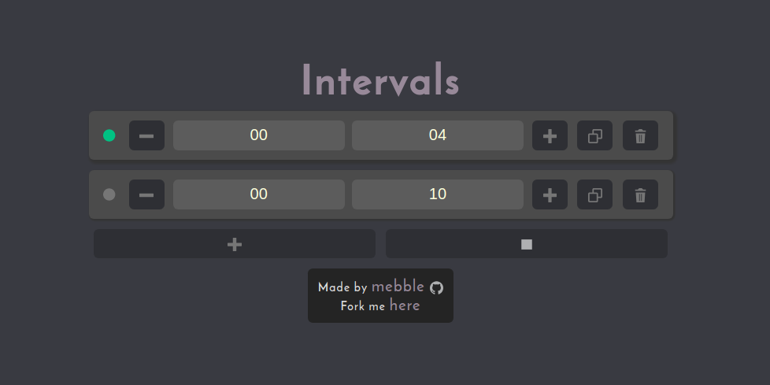

# Intervals
A lightweight interval timer web app :watch:



Keep track of time, from pomodoro sessions to interval training, right on this simple, lightweight online app. Check it out over [here](https://mebble.github.io/intervals).

## Help me out
Do the following to develop the app:

Clone the repo:
```
$ git clone https://github.com/mebble/intervals
$ cd intervals
```

Install the dependencies:
```
$ npm install
```

Run the app in development mode:
```
$ npm run dev
```
You'll now see the development server running on `http://localhost:1234`. So the app is running at this URL and it will stay updated to the code. Everytime you make changes to a file and save that file, the changes will automatically be reflected in the browser.

To make the production build of the app:
```
$ npm run build
```

You can use the [React Developer Tools Chrome extension](https://chrome.google.com/webstore/detail/react-developer-tools/fmkadmapgofadopljbjfkapdkoienihi?hl=en) to see the insides of the app in action in the browser.

## TODOs
These are the TODOs in order of priority:
- [x] drag and drop
- [ ] save presets using localStorage
- [ ] pause button
- [ ] compound intervals that consist of simple ones
- [ ] timer repeats for both simple and compound intervals
- [ ] beep on last 3 ticks before timer ends per interval
- [ ] make app work offline
